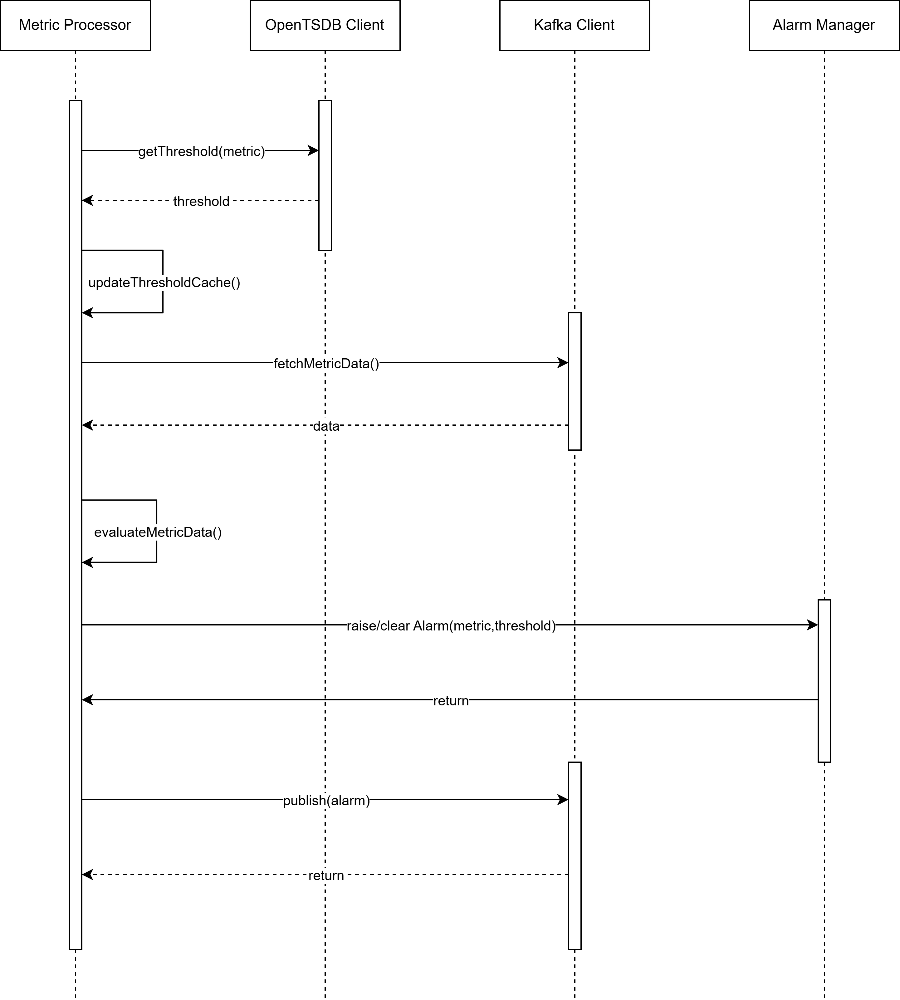

# Metrics Processor

## Overview
The Metric Processor microservice is responsible for the real-time evaluation of metric values against predefined or dynamically calculated thresholds. Based on this evaluation, it determines whether an alarm condition should be raised or cleared.

The Metric Processor operates on live metric streams and acts as the decision point between observed metric behavior and alarm generation. It relies on threshold information that may be statically configured or dynamically provided by the Fingerprint Analyzer through OpenTSDB.

## Responsibilities
The Metric Processor receives real-time metric samples from Kafka topics. It determines the applicable threshold for each metric instance. It evaluates metric values against thresholds. It raises alarms when thresholds are crossed. It clears alarms when metric values return to normal ranges. It publishes alarm state changes back to Kafka for downstream processing and persistence.

## Threshold Determination
For each incoming metric value, the Metric Processor determines which threshold should be applied.

If a fixed or user-defined threshold is configured for the metric, that threshold takes precedence and is used directly for comparison.

If no fixed threshold is configured, the Metric Processor retrieves the most recent dynamic threshold value from OpenTSDB. These dynamic thresholds are calculated and maintained by the Fingerprint Analyzer.

To improve performance and reduce repeated queries to OpenTSDB, the Metric Processor may optionally cache recently retrieved threshold values. Cache duration, refresh behavior, and eviction policies are subject to further design and tuning.

## Processing Flow
Metric values are continuously consumed from a Kafka topic carrying real-time metric data.

For each received metric value, the Metric Processor identifies the metric instance using the metric name and associated tags.

The Metric Processor checks whether a fixed or user-defined threshold exists. If such a threshold is available, it is applied immediately.

If no fixed threshold is available, the Metric Processor queries OpenTSDB to retrieve the most recent dynamic threshold associated with the metric instance.

Once the applicable threshold is determined, the Metric Processor compares the incoming metric value with the threshold boundaries.

If the metric value exceeds the defined threshold boundary, an alarm is raised. If a previously raised alarm exists and the metric value returns within the acceptable threshold range, the alarm is cleared.

Alarm state transitions are explicitly tracked to avoid duplicate or repeated alarm events.

## Alarm Generation and Publishing
When an alarm state change is detected, the Metric Processor creates an alarm event representing either a raised or cleared alarm state.

Each alarm event contains contextual information such as the metric identifier, timestamp, observed metric value, applied threshold, and alarm state.

The alarm event is published to a dedicated Kafka topic. Downstream components such as the Persistency App consume these events for storage, correlation, and visualization.

## Internal Component Responsibilities

 

The MetricProcessor component contains the core processing logic and coordinates metric consumption, threshold retrieval, comparison logic, and alarm state handling.

The Metric component represents a single metric sample and includes the metric name, value, timestamp, and associated tags.

The Threshold component encapsulates threshold data, including the threshold value or range and its type, such as fixed or dynamically calculated.

The Alarm component represents the alarm state associated with a metric instance and tracks whether the alarm is currently raised or cleared.

The KafkaClient component abstracts Kafka consumer and producer interactions.

The OpenTSDBClient component is responsible for querying OpenTSDB to retrieve dynamic threshold values.

## Sequence of Operations

 

The sequence begins when the Metric Processor receives or is ready to process a metric sample. As part of evaluating this metric, the Metric Processor first needs to determine the threshold that applies to the metric instance.

To do this, the Metric Processor sends a request to the OpenTSDB Client to retrieve the most recent threshold associated with the metric. This interaction represents the getThreshold operation shown in the sequence. The OpenTSDB Client queries OpenTSDB and returns the latest threshold value corresponding to the metric name and tags.

Once the threshold is received, the Metric Processor updates its internal threshold cache. This step is optional but important for performance optimization, as it reduces repeated queries to OpenTSDB when multiple metric samples for the same metric instance are processed within a short time window.

After ensuring the threshold is available, the Metric Processor proceeds to obtain the actual metric value to be evaluated. It interacts with the Kafka Client to fetch the metric data that was previously published by upstream components. The Kafka Client delivers the metric sample back to the Metric Processor.

With both the metric value and the applicable threshold available, the Metric Processor performs the core evaluation logic. During this step, the metric value is compared against the threshold boundaries. The Metric Processor determines whether the value lies within the expected range or represents a threshold violation.

Based on the evaluation result, the Metric Processor interacts with the Alarm Manager. If the metric value exceeds the threshold and no active alarm exists, the Metric Processor requests the Alarm Manager to raise a new alarm. If an alarm is already active and the metric value has returned to a normal range, the Metric Processor requests the Alarm Manager to clear the existing alarm. If no alarm state transition is required, no further action is taken.

The Alarm Manager processes the request and returns control to the Metric Processor, confirming that the alarm state has been updated or remains unchanged.

Finally, if an alarm state transition has occurred, the Metric Processor publishes the alarm event using the Kafka Client. This publish operation sends the alarm event to a Kafka topic dedicated to alarms, allowing downstream systems such as persistence, correlation, and visualization services to consume the event asynchronously.

The sequence concludes once the alarm event has been successfully published or no alarm action is required. The Metric Processor then continues processing subsequent metric samples in the same manner, ensuring continuous real-time evaluation.

## Error Handling and Resilience
If a threshold cannot be retrieved from OpenTSDB, the Metric Processor may skip evaluation or apply a fallback strategy based on configuration.

Transient errors during Kafka or OpenTSDB interactions are handled using retry mechanisms and logging.

The Metric Processor is designed to be stateless with respect to long-term storage, enabling horizontal scaling and fault tolerance.

## Summary
The Metric Processor serves as the real-time decision component within the dynamic thresholding architecture. By continuously evaluating incoming metric values against fixed or dynamically calculated thresholds, it enables timely detection of abnormal conditions and reliable alarm state management. Its close interaction with the Fingerprint Analyzer ensures that threshold values remain adaptive and aligned with evolving metric behavior, while integration with the Persistency App guarantees durable storage of metrics and alarms. Together with visualization components, the Metric Processor contributes to a coherent and scalable monitoring solution that supports operational awareness, fault detection, and future extensibility.

[<--Back to the Applications Overview](../index.md#applications-overview)