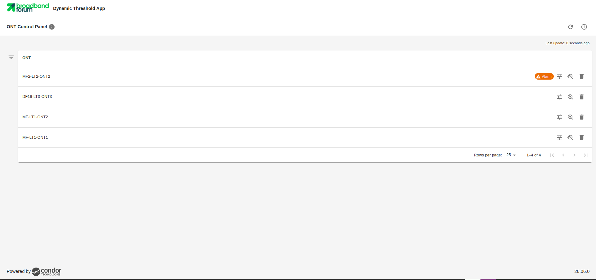
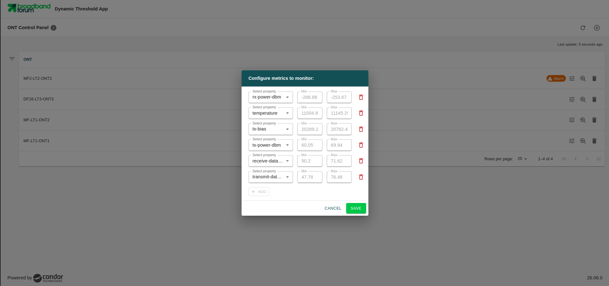
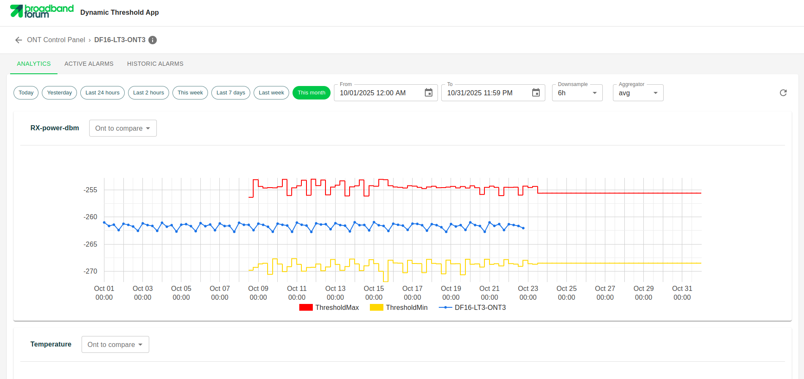
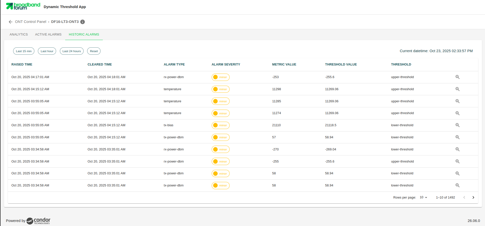

# Smart Threshold Visualizer

This web application allows to 
visualize how the thresholds for ONT metrics adapt dynamically by learning from both current and historical data.

## ONT Control Panel
This section acts as the main dashboard where one can add ONTs and select the specific metrics to be graphically displayed in the detailed view. If any of the metrics exceed the 
dynamically calculated threshold, an alarm indicator will be displayed directly on the corresponding device shown in this section.

 

## Metrics configuration
For each added ONT, one 
can individually configure and select the specific metrics one wishes to observe and analyze within the application.

 

## Analytics
This section displays a detailed graph for each configured metric. It plots the real-time values 
that the device is exporting alongside 
its corresponding dynamic thresholds, allowing for a clear visual comparison between actual behavior and dynamically set thresholds.

 

## Historical Alarms
This section contains a record of the alarms that have been triggered for a specific ONT over time. 
Each logged alarm represents a metric where the value exceeded the dynamically established threshold.

 

[<--Back to the Applications Overview](../index.md#applications-overview)