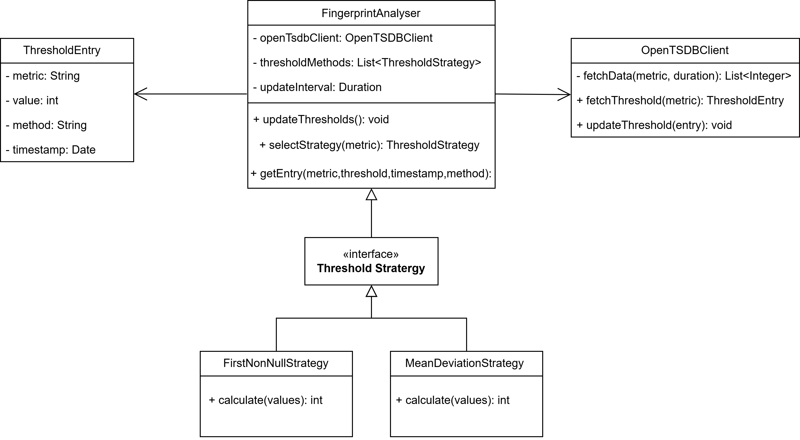
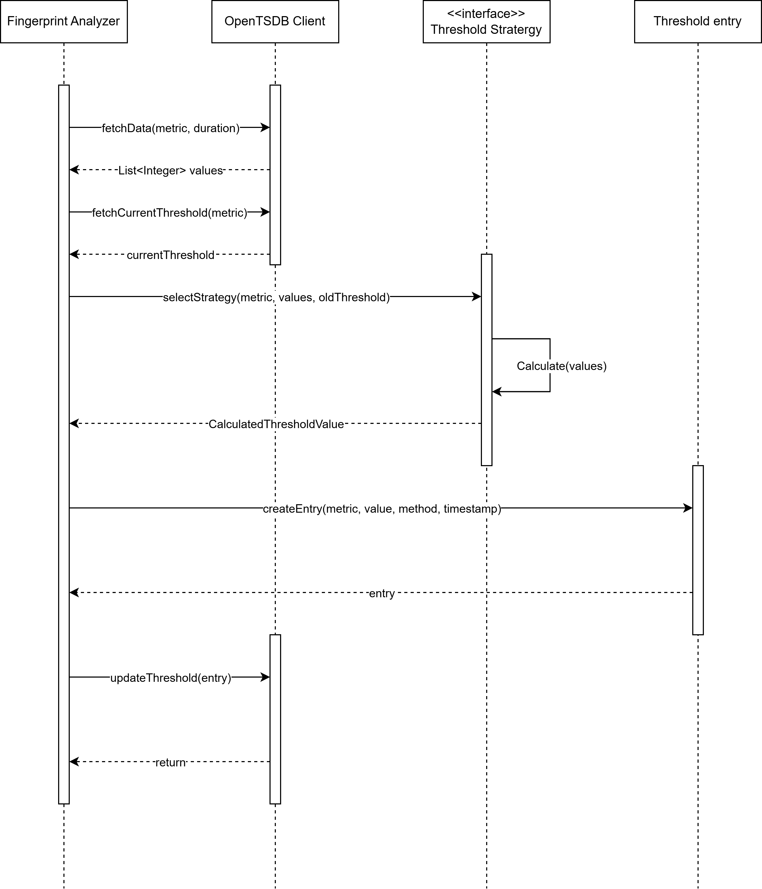

#  Fingerprint Analyzer (aka Smart Threshold Setting App)

## Overview
The Fingerprint Analyzer microservice is responsible for the dynamic discovery and maintenance of threshold values for time-series metrics. It analyzes historical metric data stored in OpenTSDB and derives threshold boundaries that represent the expected operating range of each metric instance.

The calculated thresholds are persisted back into OpenTSDB and consumed by downstream components such as the Metric Processor for anomaly detection and alarm generation. The Fingerprint Analyzer itself does not raise alarms.

## Responsibilities
The Fingerprint Analyzer performs the following functions:

* It periodically retrieves historical metric data from OpenTSDB.
* It applies a configurable threshold calculation strategy.
* It calculates threshold values for each metric instance.
* It persists calculated thresholds back into OpenTSDB as derived metrics.
* It ensures thresholds evolve over time as metric behavior changes.

## Threshold Mechanism
The Fingerprint Analyzer supports multiple threshold calculation mechanisms. The mechanism to be applied is configurable.

### FirstNonNullValue
This mechanism derives a threshold by capturing the first available non-null value of a metric.

This approach is intended for rapid threshold initialization and is commonly used during cold-start scenarios when insufficient historical data is available.

The threshold is calculated as the first non-null value observed in the historical metric data. This value further used for calculating lower and upper threshold until sufficient data is available for more advanced calculation methods.

### MeanAndDeviation
This mechanism derives dynamic thresholds using statistical properties of historical metric values.

The Fingerprint Analyzer calculates the mean and standard deviation of the metric values over a configurable historical time range. Thresholds are then derived by applying a configurable offset to the standard deviation.

The upper threshold is calculated as the mean plus the offset multiplied by the standard deviation.
The lower threshold is calculated as the mean minus the offset multiplied by the standard deviation.

This mechanism provides adaptive thresholds that adjust automatically as metric behavior changes over time.

## Configurable Parameters
Threshold calculation behavior can be tuned using configuration parameters.

The offset parameter determines sensitivity to deviations. Typical values include two or three standard deviations.
The historical time range defines how much past data is used for calculation, such as the last seven days.
A minimum sample count can be configured to ensure statistical validity.

If insufficient samples are available, the Fingerprint Analyzer may fall back to the FirstNonNullValue mechanism.

## Update Process
The Fingerprint Analyzer operates on a periodic schedule.

During each update cycle, it queries OpenTSDB to retrieve existing threshold values.
It retrieves historical time-series data for the configured time range.
For each metric instance, it computes updated threshold values using the selected calculation mechanism.
It stores the updated threshold values back into OpenTSDB as derived metrics.

This process ensures thresholds remain aligned with current metric behavior.

## Visualization
Calculated thresholds are stored as time-series data and can be visualized together with raw metric values.

Operators can observe metric behavior, threshold evolution, and alarm correlation in a dedicated dashboard.

## UML Class Design

 

The Fingerprint Analyzer follows a strategy-based design pattern to support extensibility.

The FingerprintAnalyzer component acts as the central orchestrator. It triggers periodic updates, selects the appropriate threshold strategy, and coordinates data retrieval and persistence.

The ThresholdStrategy defines a common contract for threshold calculation. Different calculation mechanisms implement this interface.

The FirstNonNullStrategy returns the first non-null value from the metric history.

The MeanDeviationStrategy computes thresholds using the mean and standard deviation with a configurable offset.

The OpenTSDBClient component handles communication with OpenTSDB for fetching historical data and storing calculated thresholds.

The ThresholdEntry represents a threshold record including metric identification, calculated values, timestamp, and associated metadata.

## Sequence of Operations

 

The Fingerprint Analyzer is triggered by a scheduler that defines how frequently threshold values are recalculated. This scheduler operates independently of real-time metric ingestion and ensures that threshold updates occur at regular, configurable intervals. The scheduling interval is chosen to balance responsiveness to metric behavior changes with system performance considerations.

Once triggered, the Fingerprint Analyzer retrieves historical metric data from OpenTSDB. The retrieval is performed for each relevant metric instance using a configured historical time range, such as the last seven days. Metric tags are preserved during retrieval to ensure that thresholds are calculated per metric instance and not aggregated across unrelated entities. Any null, missing, or invalid samples may be filtered out prior to further processing.

After the historical data is retrieved, the Fingerprint Analyzer selects the appropriate threshold calculation strategy. The strategy selection is based on configuration and data availability. If sufficient historical data exists, a statistical strategy such as MeanAndDeviation is selected. If historical data is insufficient or the metric is newly observed, the FirstNonNullValue strategy may be selected as a fallback. This selection mechanism ensures robust behavior across both steady-state and cold-start scenarios.

The Fingerprint Analyzer then computes the threshold values using the selected strategy. For statistical strategies, the mean and standard deviation are calculated from the historical data set, and configurable sensitivity parameters are applied to derive upper and lower threshold boundaries. For initialization strategies, the threshold is derived directly from the first valid observed value. The calculation process is isolated per metric instance to avoid cross-metric influence.

Finally, the calculated threshold values are written back to OpenTSDB as derived time-series metrics. The thresholds are stored with the same metric tags as the original metric to preserve correlation and enable downstream consumption. 
Storing thresholds as time-series data allows threshold evolution to be tracked over time and enables visualization 
alongside raw metrics. These stored thresholds are then available for consumption by the Metric Processor, 
which uses them to evaluate real-time metric values and generate alarms.

[<--Back to the Applications Overview](../index.md#applications-overview)