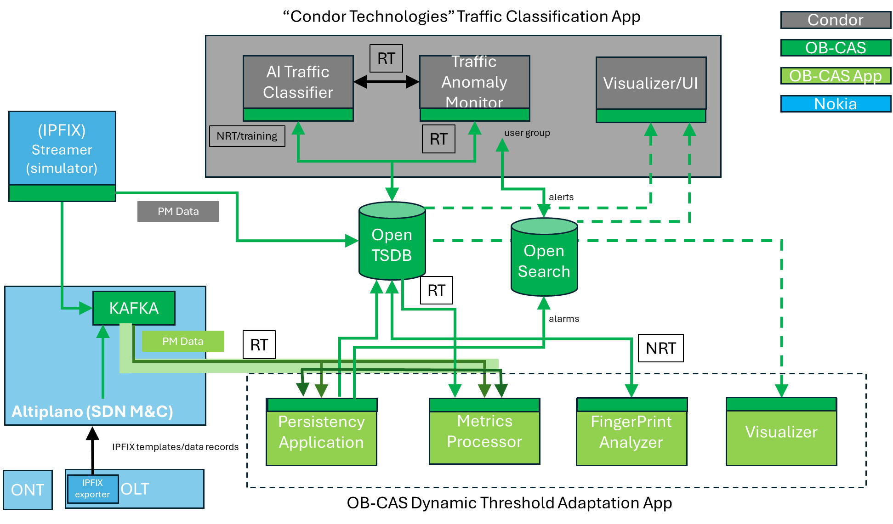

# OB-CAS Demonstrations

OB-CAS is demonstrating its concepts and specific use cases to an external audience every year at Network-X event, as one of 
the Innovation Demos at the Broadband Forum booth on the annual Network-X event.

The following demonstrations have been provided:

* Alarm Correlation Demo 2024 (OB-CAS) : more information and guidelines on how to set-up the demo, can be 
  found [here](./alarm_correlation/index.md#alarm-correlation-demonstration)

* Dynamic Threshold Setting Demo 2025 (OB-CAS, Nokia) : more information can be found [here](./smart_threshold/index.md#dynamic-threshold-setting-demo)

* Traffic Classification Demo 2025 (OB-CAS, Condor Technologies) : more information can be found [here](./traffic_classification/index.md#traffic-classification-demonstration)

Below figure shows the 2025 Network-X OB-CAS Innovation Demo set-up where at the same time next to the OB-CAS dynamic threshold setting app, also 
the Condor Technologies' traffic classification app was demoed.

 

[<--Back to the PON simulator](../sdk/pon_simulator/index.md)

[<<--Introduction](../index.md)