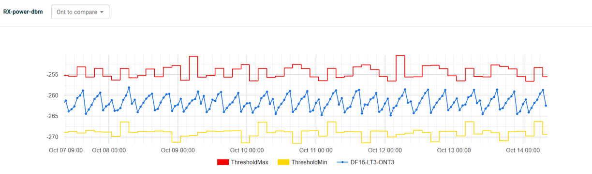
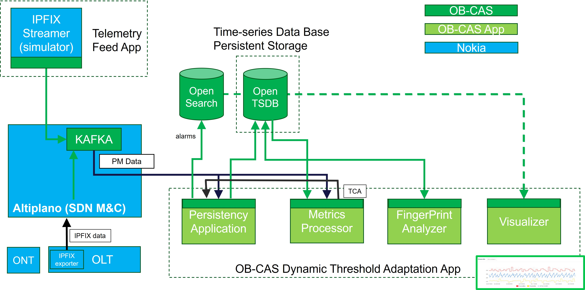

# Dynamic Threshold Setting Demo

The dynamic threshold setting application suite was demonstrated as Innovation Demo in October 2025 on the Broadband Forum network booth at the Network-X event in Paris

An overview of this OB-CAS live demo can be seen in this clip:


## Overview

This demo leverages time series of performance monitoring (PM) data to apply the dynamic threshold setting, and makes use of the OpenTSDB API. It allows to 
analyze time series of (PM) data coming from real OLT and ONT devices (controlled by the Nokia Access SDN controller Altiplano) 
exported by the OLT through IPFIX protocol, as well as time series data generated by an IPFIX simulator, simulating IPFIX data streams 
generated by non-real OLT/ONTs.  

Often devices allow to set Threshold Crossing Alerts (TCAs) for a given metric that is sampled by this device regularly in time. E.g. the temperature of a laser associated with a transceiver held by that device, 
or the measured optical input power of an optical receiver. 
When the measured value exceeds the statically and pre-defined thresholds for such metric, the device will generate an alert (alarm).
Setting the thresholds too close to the (average) measured value, will generate false alarms (false negatives) , setting the thresholds 
too far, 
might result in certain anomalies not being detected (false positives). In that case, when these anomalies would have been alerted and investigated,
an underlying pattern or trend might have been revealed, e.g. providing indication that the module is no longer in a healthy state, 
which can be simply resolved with pro-active handling (eg replacement of the module during maintenance window).

Rather than having fixed and static thresholds, this demo demonstrates how samples of individual metrics are constantly monitored 
in the cloud allowing to set dynamic threshold levels.
This way, one can take into account diurnal/weekly/seasonal patterns (eg temperature, traffic load,..) where TCAs 
will be taking into account these patterns.
Also, for some metrics, one may allow certain sample values to be out of range (too high, too low)  
when spanning across one or a few sampling times, 
whereas this may not be tolerated for the longer-term average of that metric.

Wit this demo, the metrics are hence continuously ingested into the cloud, constantly monitored and where a smart alogorithm or 
AI application will set thresholds in a dynamic way. When the smart threshold is crossed, the cloud generates the TCA.

Below is an example where the threshold is set for the Rx power of a PON transceiver by the algorithm based on an observed pattern, as visualized in the demo UI.

<p align="center">
 
</p>


The figure below shows the different components involved in the set-up for this demo.


<p align="center">
 
</p>

## IPFIX Simulator

The IPFIX simulator is contributed as a closed microservice by Nokia to 
be used for testing and demonstration of the  OB-CAS dynamic threshold setting app.
It allows to define a range of metrics, and have the generator generate a pattern for the time series of each metric separately, 
resulting in a time series of samples for each defined metric. Values are output via the Kafka Publisher API one by one by the simulator simulating a real-time metric 
collection. 

Two examples of a single output (single metric, one sample ) are provided below:

~~~ 
{"anv:device-manager":{"anv-device-holders:device":[{"device-id":"DF16-LT3","timestamp":"2025-10-08T09:22:00+0000","device-specific-data":{"bbf-fiber-onu-emulated-mount:onus":{"onu":[{"name":"ONT3","root":{"ietf-hardware-mounted:hardware-state":{"component":[{"name":"ANIPORT","bbf-hardware-transceivers-mounted:transceiver-link":{"diagnostics":{"tx-bias":21380}}}]}}}]}}}]}}
{"anv:device-manager":{"anv-device-holders:device":[{"device-id":"DF16-LT3","timestamp":"2025-10-08T09:22:00+0000","device-specific-data":{"bbf-fiber-onu-emulated-mount:onus":{"onu":[{"name":"ONT3","root":{"ietf-hardware-mounted:hardware-state":{"component":[{"name":"SFP","bbf-hardware-transceivers-mounted:transceiver":{"diagnostics":{"temperature":11230}}}]}}}]}}}]}}
~~~ 

For demo purposes, the IPFIX simulator can be instructed to generate certain anomalies 
where one or a few sample values are created that are all in the high range (or all in the low range), and likely to generate a TCA.

## Persistency Application v2

For more information, please go [here](../../apps/persister_v2/persister_v2.md)


## Metrics Processor

For more information, please go [here](../../apps/metrics_processor/metrics_processor.md)

## Fingerprint Analyzer (aka as Dynamic Threshold Setting App)

For more information, please go [here](../../apps/threshold_setting/threshold_setting.md)

## Visualizer

For more information, please go [here](../../apps/smart_threshold_visualizer/smart_threshold_visualizer.md)


## Demo Set-up

This section describes the complete setup to demonstrate Dynamic Threshold Adaptation  using the OB-CAS platform.

### Prerequisites

Ensure the following components are available and accessible:
* Docker & Docker Compose installed 
* Access to the OBCAS repository

### Clone the OB-CAS Repository

```
git clone git@bitbucket.org:broadband-forum/obcas.git
cd obcas 
```
### Locate the Deployment File
The Docker Compose file for this setup is available at:
```
~/obcas/resources/examples/e2e_compose_data/obcas_apps_for_dynamic_threshold_adaptation.yaml
```

### Update Configuration
Edit the Docker Compose file and update the following parameters with your environment-specific values:

* BAA Server Public IP 
* Kafka Bootstrap Server 
* OpenTSDB Host 
* OpenSearch Host

These must be updated for the following services/apps:

* obcas-persister-app 
* metric-processor-app 
* fingerprint-analyzer-app

### Start the Environment 
Launch all services using Docker Compose:

```
docker-compose -f ~/obcas/resources/examples/e2e_compose_data/obcas_apps_for_dynamic_threshold_adaptation.yaml up -d
```
This command will start the Core OB-CAS applications  and the supporting infrastructure services (Kafka, OpenTSDB, OpenSearch, etc.)

Note: Wait until all containers are fully initialized and healthy before proceeding.

### Data Ingestion
Once the system is up, begin publishing performance data to Kafka using Topic Name: obcas-performance-data

### Verification of Data Flow
   To verify that data is being published to Kafka:


```
docker exec -it kafka bash
/usr/bin/kafka-console-consumer --topic "obcas-performance-data" --bootstrap-server 127.0.0.1:29092
```
Expected Result:
You should see incoming performance data messages from the source.

### Application Workflow
#### Persister Application
-Consumes performance data from Kafka
-Stores the data into OpenTSDB

#### Fingerprint Analyzer
-Retrieves historical performance data from OpenTSDB
-Computes dynamic lower and upper thresholds
-Stores computed thresholds back into OpenTSDB

Configuration Note: the default time window for threshold calculation is 3 hours
This can be modified in the Docker Compose configuration

#### Metric Processor
-Consumes real-time data from Kafka
-Fetches threshold values from OpenTSDB
-Performs validation:
If data is within threshold ? No action  /   If data exceeds threshold ? Alarm is generated

#### Alarm Management
* Active Alarms : are stored in OpenSearch index:

```
obcas-active-alarms
```
* Historical Alarms : when metrics return to normal range, the active alarms are cleared, and moved to OpenSearch index:

```
obcas-history-alarms
```

#### Visualizer

[<--Back to the Demonstrations Overview](../index.md)